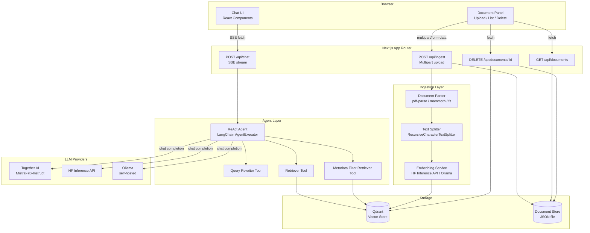
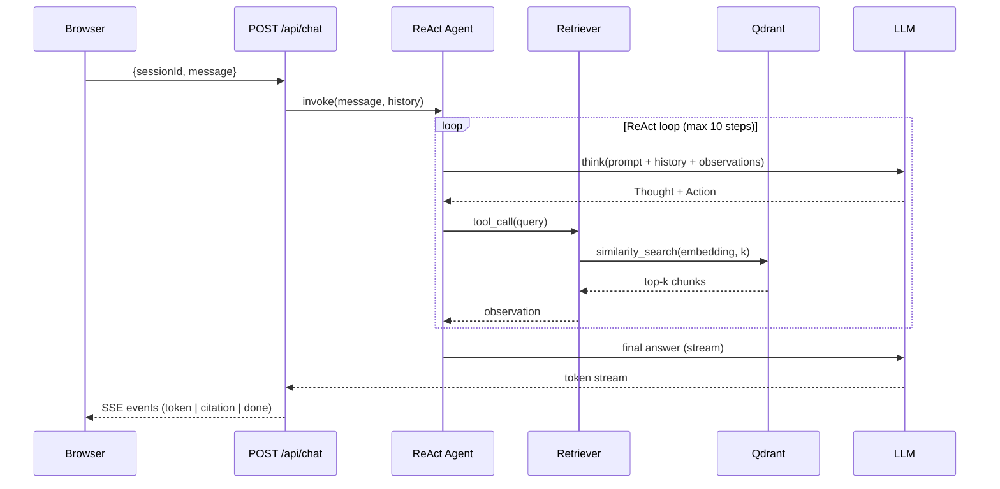
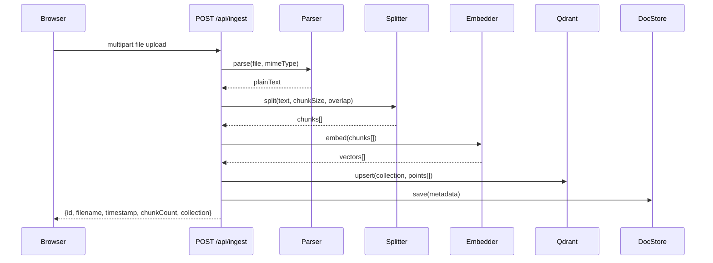

# Architecture: Agentic RAG System

## Overview

This system is a Next.js 16 application that lets users upload documents and ask questions answered by an agentic LLM pipeline. The agent uses a ReAct (Reasoning + Acting) loop to retrieve relevant document chunks from a Qdrant vector database, reason across multiple retrieval steps, and stream a grounded answer back to the browser.

---

## Component Diagram



---

## Data Flow: Chat Query



---

## Data Flow: Document Ingestion



---

## Technology Decisions

| Technology | Choice | Rationale |
|---|---|---|
| Framework | Next.js 16 (App Router) | Full-stack TypeScript, built-in Route Handlers for API, SSE support via `ReadableStream` |
| Agent orchestration | LangChain.js | Provider-agnostic LLM abstraction, built-in ReAct agent, memory, and tool support |
| LLM (default) | Mistral-7B-Instruct via Together AI | Open source, strong instruction following, fast inference, no proprietary lock-in |
| Vector DB | Qdrant | Open source, supports payload filtering, named collections, cloud and self-hosted options |
| Embedding model | BAAI/bge-small-en-v1.5 | Open source, 384-dim (small and fast), strong retrieval performance for English text |
| Embedding host | HF Inference API | No local GPU required for development; swappable to Ollama for fully local setup |
| Streaming | Server-Sent Events (SSE) | Simpler than WebSockets for unidirectional server→client streaming; works with `fetch` |
| Logging | pino | Structured JSON output, low overhead, configurable log levels |
| Config validation | zod | Type-safe env var parsing with descriptive error messages |
| Property testing | fast-check | TypeScript-native, works in Node.js, integrates with vitest |
| PDF parsing | pdf-parse | Lightweight, no native dependencies |
| DOCX parsing | mammoth | Clean text extraction from .docx, no LibreOffice dependency |

---

## Deployment

### Local Development (Qdrant via Docker)

```bash
# Start Qdrant
docker run -p 6333:6333 -v $(pwd)/qdrant_storage:/qdrant/storage qdrant/qdrant

# Set QDRANT_URL=http://localhost:6333 in .env.local
```

### Qdrant Cloud

1. Create a free cluster at https://cloud.qdrant.io
2. Copy the cluster URL and API key
3. Set `QDRANT_URL=<cluster-url>` and `QDRANT_API_KEY=<api-key>` in `.env.local`

### Fully Local (Ollama)

```bash
# Install Ollama: https://ollama.com
ollama pull mistral          # LLM
ollama pull bge-small-en     # Embedding model

# Set in .env.local:
# LLM_PROVIDER=ollama
# EMBEDDING_PROVIDER=ollama
# OLLAMA_BASE_URL=http://localhost:11434
```

---

## Scaling Considerations

**Multiple document sets**: Use separate Qdrant collections (set `collection` field on ingest). Each collection is isolated — queries to one never return results from another.

**Batch ingestion**: The ingestion pipeline processes one file at a time. For bulk ingestion, call `POST /api/ingest` in parallel with a concurrency limit to avoid overwhelming the embedding API.

**Session persistence**: Sessions are currently held in a server-side in-memory `Map`. This means sessions are lost on server restart and do not work across multiple server instances. For production, replace with Redis or a database-backed session store.

**Document store**: The default `data/documents.json` file store is suitable for development. For production, replace `lib/docstore/doc-store.ts` with a SQLite or PostgreSQL implementation behind the same interface.

**Embedding dimension lock-in**: Once a Qdrant collection is created with a given vector dimension, you cannot change the embedding model without creating a new collection and re-ingesting all documents. Plan your embedding model choice before ingesting production data.
