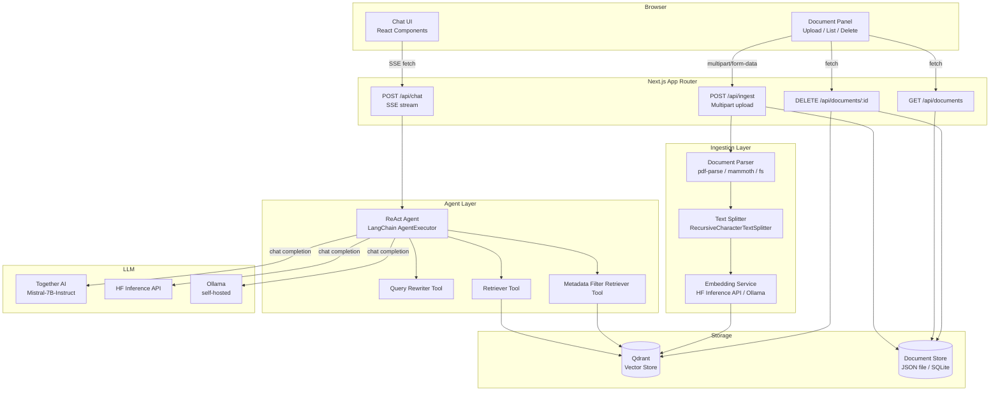
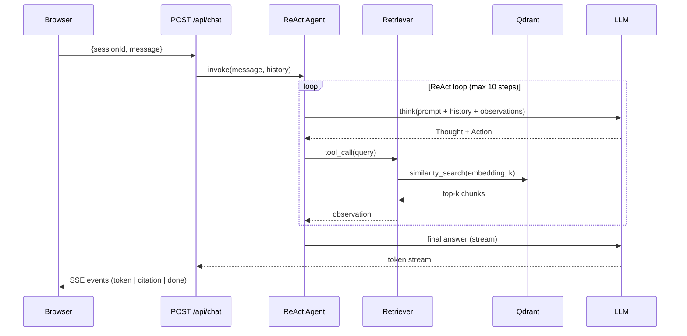
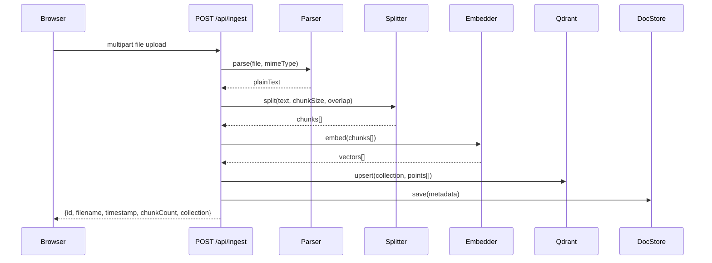

# Design Document: Agentic RAG System

## Overview

This document describes the technical design for an Agentic Retrieval-Augmented Generation (RAG) system built on Next.js 16. Users upload documents (PDF, TXT, MD, DOCX), which are chunked, embedded, and stored in Qdrant. A LangChain ReAct agent answers questions by reasoning across multiple retrieval steps, streaming responses token-by-token to a chat UI.

**Key technology choices:**
- Framework: Next.js 16 (App Router, Route Handlers)
- Agent orchestration: LangChain.js
- LLM: Mistral-7B-Instruct via Together AI (configurable)
- Vector DB: Qdrant (cloud or self-hosted)
- Embedding model: BAAI/bge-small-en-v1.5 via Hugging Face Inference API (configurable)
- Streaming: Server-Sent Events (SSE)
- Logging: pino (structured JSON)

---

## Architecture

### Component Diagram



### Data Flow: Chat Query



### Data Flow: Document Ingestion



---

## Components and Interfaces

### File / Folder Structure

```
/
├── app/
│   ├── layout.tsx                  # Root layout
│   ├── page.tsx                    # Chat page (/)
│   ├── globals.css
│   └── api/
│       ├── chat/
│       │   └── route.ts            # POST /api/chat  (SSE)
│       ├── ingest/
│       │   └── route.ts            # POST /api/ingest
│       ├── documents/
│       │   ├── route.ts            # GET /api/documents
│       │   └── [id]/
│       │       └── route.ts        # DELETE /api/documents/[id]
│       └── health/
│           └── route.ts            # GET /api/health
│
├── lib/
│   ├── agent/
│   │   ├── agent.ts                # AgentExecutor factory
│   │   ├── tools.ts                # Tool definitions (retriever, rewriter, filter)
│   │   └── pretty-printer.ts       # ReAct trace formatter
│   ├── ingestion/
│   │   ├── parser.ts               # File → plain text
│   │   ├── splitter.ts             # Text → chunks
│   │   └── pipeline.ts             # Orchestrates parse→split→embed→store
│   ├── vectorstore/
│   │   ├── qdrant-client.ts        # Qdrant client singleton
│   │   └── retriever.ts            # LangChain retriever wrapper
│   ├── embeddings/
│   │   └── embedder.ts             # Embedding model factory
│   ├── llm/
│   │   └── llm-factory.ts          # LLM provider factory
│   ├── docstore/
│   │   └── doc-store.ts            # Document metadata CRUD
│   ├── logging/
│   │   └── logger.ts               # pino logger singleton
│   └── config/
│       └── env.ts                  # Env var validation + typed config
│
├── components/
│   ├── chat/
│   │   ├── ChatWindow.tsx          # Message list + input
│   │   ├── MessageBubble.tsx       # Single message with citations
│   │   ├── CitationCard.tsx        # Expandable citation
│   │   └── AgentTrace.tsx          # Dev-mode trace panel
│   └── documents/
│       ├── DocumentPanel.tsx       # Upload + document list
│       ├── DropZone.tsx            # Drag-and-drop upload
│       └── DocumentRow.tsx         # Single document entry
│
├── types/
│   └── index.ts                    # Shared TypeScript types
│
├── data/
│   └── documents.json              # Document metadata store (dev)
│
├── .env.example
├── .env.local                      # (gitignored)
└── archive/                        # Boilerplate files moved here
    └── ...
```

### Key Interfaces (TypeScript)

```typescript
// lib/agent/agent.ts
export interface AgentFactory {
  createAgent(config: AgentConfig): Promise<AgentExecutor>;
}

// lib/ingestion/pipeline.ts
export interface IngestionPipeline {
  ingest(file: File | Buffer, filename: string, mimeType: string): Promise<DocumentMetadata>;
}

// lib/vectorstore/retriever.ts
export interface RAGRetriever {
  retrieve(query: string, k: number, filter?: MetadataFilter): Promise<DocumentChunk[]>;
}

// lib/embeddings/embedder.ts
export interface EmbeddingService {
  embed(texts: string[]): Promise<number[][]>;
  getDimension(): number;
}
```

---

## Data Models

### DocumentMetadata

Stored in the Document Store (JSON file for dev, SQLite/Postgres for prod).

```typescript
interface DocumentMetadata {
  id: string;              // UUID v4
  filename: string;        // Original filename
  mimeType: string;        // e.g. "application/pdf"
  uploadedAt: string;      // ISO 8601 timestamp
  chunkCount: number;      // Number of chunks stored
  collection: string;      // Qdrant collection name
  sizeBytes: number;       // Original file size
}
```

### Chunk

Stored as a Qdrant point payload alongside its embedding vector.

```typescript
interface DocumentChunk {
  id: string;              // UUID v4 (Qdrant point ID)
  documentId: string;      // FK → DocumentMetadata.id
  filename: string;        // Denormalized for citation display
  collection: string;      // Qdrant collection name
  chunkIndex: number;      // 0-based position within document
  text: string;            // Raw chunk text
  tokenCount: number;      // Approximate token count
  metadata: Record<string, unknown>; // Arbitrary filterable fields
}
```

### Session

Held in memory (server-side Map keyed by sessionId) and optionally persisted.

```typescript
interface Session {
  id: string;              // UUID v4
  createdAt: string;       // ISO 8601
  messages: ChatMessage[];
  agentMemory: BufferMemory; // LangChain memory object
}

interface ChatMessage {
  role: "user" | "assistant";
  content: string;
  citations?: Citation[];
  agentTrace?: ReActTrace; // Only in development mode
  timestamp: string;
}
```

### Citation

```typescript
interface Citation {
  documentId: string;
  filename: string;
  chunkIndex: number;
  text: string;            // The retrieved chunk text
  score: number;           // Cosine similarity score
}
```

### SSE Event Shapes

```typescript
// Streamed over POST /api/chat
type SSEEvent =
  | { type: "token";    data: string }
  | { type: "citation"; data: Citation }
  | { type: "trace";    data: ReActTrace }   // dev mode only
  | { type: "done";     data: { sessionId: string } }
  | { type: "error";    data: { message: string } };
```

### Qdrant Collection Schema

Each collection stores points with:

| Field | Type | Description |
|---|---|---|
| `id` | UUID string | Qdrant point ID = chunk UUID |
| `vector` | float[] | Embedding vector (384-dim for bge-small) |
| `payload.documentId` | string | FK to DocumentMetadata |
| `payload.filename` | string | Source filename |
| `payload.chunkIndex` | number | Position in document |
| `payload.text` | string | Raw chunk text |
| `payload.tokenCount` | number | Approximate token count |
| `payload.uploadedAt` | string | ISO 8601 |

Default collection name: `"documents"`. Multiple collections are supported for document set isolation.

---

## API Design

### POST /api/chat

**Request:**
```json
{
  "sessionId": "uuid-or-null",
  "message": "What does the contract say about termination?",
  "collection": "documents"
}
```

**Response:** `Content-Type: text/event-stream`
```
data: {"type":"token","data":"The contract"}
data: {"type":"token","data":" states that"}
data: {"type":"citation","data":{"filename":"contract.pdf","chunkIndex":12,"text":"...","score":0.91}}
data: {"type":"done","data":{"sessionId":"abc-123"}}
```

**Errors:** `400` for missing `message`; `500` for agent/LLM failure (with sanitized message).

---

### POST /api/ingest

**Request:** `Content-Type: multipart/form-data`
- `file`: the document file
- `collection` (optional, default `"documents"`): target collection name

**Response 200:**
```json
{
  "id": "uuid",
  "filename": "report.pdf",
  "uploadedAt": "2024-01-15T10:30:00Z",
  "chunkCount": 42,
  "collection": "documents",
  "sizeBytes": 204800
}
```

**Errors:** `400` unsupported format or missing file; `500` embedding/storage failure.

---

### GET /api/documents

**Response 200:**
```json
[
  {
    "id": "uuid",
    "filename": "report.pdf",
    "uploadedAt": "2024-01-15T10:30:00Z",
    "chunkCount": 42,
    "collection": "documents",
    "sizeBytes": 204800
  }
]
```

---

### DELETE /api/documents/[id]

**Response:** `204 No Content`

**Errors:** `404` if document not found; `500` if Qdrant deletion fails.

---

### GET /api/health

**Response 200:**
```json
{
  "status": "ok",
  "qdrant": "connected",
  "llm": "configured",
  "embedding": "configured"
}
```

---

## Ingestion Pipeline Design

```
File Upload
    │
    ▼
┌─────────────────────────────────────────────────────┐
│ 1. Validate MIME type / extension                   │
│    Supported: pdf, txt, md, docx                    │
│    → 400 error if unsupported                       │
└─────────────────────────────────────────────────────┘
    │
    ▼
┌─────────────────────────────────────────────────────┐
│ 2. Parse to plain text                              │
│    PDF  → pdf-parse                                 │
│    DOCX → mammoth                                   │
│    TXT/MD → utf-8 read                              │
└─────────────────────────────────────────────────────┘
    │
    ▼
┌─────────────────────────────────────────────────────┐
│ 3. Split into chunks                                │
│    RecursiveCharacterTextSplitter                   │
│    chunkSize: CHUNK_SIZE (default 512 tokens)       │
│    chunkOverlap: CHUNK_OVERLAP (default 64 tokens)  │
└─────────────────────────────────────────────────────┘
    │
    ▼
┌─────────────────────────────────────────────────────┐
│ 4. Generate embeddings                              │
│    Batch call to Embedding_Model                    │
│    → error + rollback if service unavailable        │
└─────────────────────────────────────────────────────┘
    │
    ▼
┌─────────────────────────────────────────────────────┐
│ 5. Validate dimension against collection            │
│    → error if mismatch, no writes                   │
└─────────────────────────────────────────────────────┘
    │
    ▼
┌─────────────────────────────────────────────────────┐
│ 6. Upsert points to Qdrant                          │
│    Atomic batch upsert                              │
└─────────────────────────────────────────────────────┘
    │
    ▼
┌─────────────────────────────────────────────────────┐
│ 7. Save DocumentMetadata to DocStore                │
└─────────────────────────────────────────────────────┘
```

**Atomicity:** Steps 6 and 7 are treated as a logical unit. If Qdrant upsert fails, DocStore is not written. If DocStore write fails after a successful Qdrant upsert, a compensating delete is issued to Qdrant.

---

## Agent / RAG Pipeline Design

### ReAct Loop

```
User Query
    │
    ▼
┌──────────────────────────────────────────────────────┐
│ AgentExecutor (LangChain)                            │
│                                                      │
│  step = 0                                            │
│  while step < MAX_STEPS (10):                        │
│    1. LLM generates: Thought + Action + Action Input │
│    2. Execute tool (Retriever / Rewriter / Filter)   │
│    3. Append Observation to scratchpad               │
│    4. If Action == "Final Answer": break             │
│    step++                                            │
│                                                      │
│  If step == MAX_STEPS: return partial answer + note  │
└──────────────────────────────────────────────────────┘
    │
    ▼
Stream final answer tokens + citations via SSE
```

### Tools

| Tool | Description | Input | Output |
|---|---|---|---|
| `retriever` | Semantic similarity search | `{query: string, k?: number}` | `DocumentChunk[]` |
| `metadata_filter_retriever` | Filtered similarity search | `{query: string, filter: MetadataFilter, k?: number}` | `DocumentChunk[]` |
| `query_rewriter` | Reformulate query for better retrieval | `{query: string}` | `string[]` (1–3 alternatives) |

### Query Rewriter

The query rewriter is a separate LLM call with a focused prompt that produces up to 3 alternative phrasings. The agent then calls the retriever for each alternative and deduplicates results by chunk ID before synthesis.

### Citation Extraction

After the agent produces its final answer, a post-processing step scans the scratchpad for all `Observation` entries, extracts the `DocumentChunk` objects, deduplicates by chunk ID, and attaches them as `Citation[]` to the response.

---

## Embedding Model Integration

The `EmbeddingService` is a factory that returns the correct implementation based on `EMBEDDING_PROVIDER`:

| Provider | Env var | Implementation |
|---|---|---|
| `huggingface` (default) | `HF_API_KEY` | `@langchain/community` HuggingFaceInferenceEmbeddings |
| `ollama` | `OLLAMA_BASE_URL` | `@langchain/ollama` OllamaEmbeddings |
| `openai-compatible` | `EMBEDDING_API_BASE`, `EMBEDDING_API_KEY` | Custom OpenAI-compatible endpoint |

Default model: `BAAI/bge-small-en-v1.5` (384-dimensional vectors).

The dimension is read from the first embedding call and cached. On subsequent ingestion to an existing collection, the cached dimension is compared against the collection's configured vector size in Qdrant. A mismatch returns a 400 error.

---

## Streaming SSE Design

`POST /api/chat` returns a `ReadableStream` with `Content-Type: text/event-stream`.

```typescript
// Pseudocode for route handler
export async function POST(req: Request) {
  const { sessionId, message } = await req.json();

  const stream = new ReadableStream({
    async start(controller) {
      const encoder = new TextEncoder();
      const emit = (event: SSEEvent) =>
        controller.enqueue(encoder.encode(`data: ${JSON.stringify(event)}\n\n`));

      try {
        for await (const chunk of agent.stream(message, sessionId)) {
          if (chunk.type === "token")    emit({ type: "token",    data: chunk.token });
          if (chunk.type === "citation") emit({ type: "citation", data: chunk.citation });
        }
        emit({ type: "done", data: { sessionId } });
      } catch (err) {
        emit({ type: "error", data: { message: sanitizeError(err) } });
      } finally {
        controller.close();
      }
    }
  });

  return new Response(stream, {
    headers: {
      "Content-Type": "text/event-stream",
      "Cache-Control": "no-cache",
      "Connection": "keep-alive",
    },
  });
}
```

The browser client uses the `EventSource`-compatible `fetch` + `ReadableStream` pattern (not `EventSource` constructor, since the request is a POST).

---

## Observability / Logging Design

All logging uses **pino** for structured JSON output.

### Log Levels

| Level | Usage |
|---|---|
| `ERROR` | Pipeline failures, unhandled exceptions (includes stack trace) |
| `WARN` | Recoverable issues (e.g., partial retrieval, retry) |
| `INFO` | Agent invocation start/end, ingestion start/end |
| `DEBUG` | Tool call inputs/outputs, chunk details, token counts |

### Structured Log Fields

Every log entry includes:

```json
{
  "level": "info",
  "time": "2024-01-15T10:30:00.000Z",
  "service": "agentic-rag",
  "sessionId": "abc-123",
  "traceId": "uuid"
}
```

Agent invocation log (INFO):
```json
{
  "event": "agent.invocation",
  "sessionId": "abc-123",
  "query": "...",
  "stepCount": 4,
  "toolCallCount": 3,
  "durationMs": 2340
}
```

Tool call log (DEBUG):
```json
{
  "event": "agent.tool_call",
  "tool": "retriever",
  "input": {"query": "termination clause", "k": 5},
  "outputChunkCount": 5,
  "durationMs": 120
}
```

### Pretty Printer (Development Mode)

In `NODE_ENV=development`, the `PrettyPrinter` formats the ReAct scratchpad:

```
[Step 1]
  Thought: I need to find the termination clause in the contract.
  Action: retriever
  Input: {"query": "termination clause", "k": 5}
  Observation: Found 5 chunks from contract.pdf (chunks 10-14)

[Step 2]
  Thought: I have enough context to answer.
  Action: Final Answer
  Answer: The contract states that either party may terminate...
```

---

## Environment Variable Schema

All variables are validated at startup by `lib/config/env.ts` using **zod**. Missing required variables cause the process to exit with a descriptive error.

| Variable | Required | Default | Description |
|---|---|---|---|
| `LLM_PROVIDER` | No | `together` | LLM provider: `together`, `huggingface`, `ollama` |
| `LLM_MODEL` | No | `mistralai/Mistral-7B-Instruct-v0.2` | Model name for the selected provider |
| `TOGETHER_API_KEY` | If `LLM_PROVIDER=together` | — | Together AI API key |
| `HF_API_KEY` | If `LLM_PROVIDER=huggingface` or `EMBEDDING_PROVIDER=huggingface` | — | Hugging Face API key |
| `OLLAMA_BASE_URL` | If `LLM_PROVIDER=ollama` or `EMBEDDING_PROVIDER=ollama` | `http://localhost:11434` | Ollama server URL |
| `EMBEDDING_PROVIDER` | No | `huggingface` | Embedding provider: `huggingface`, `ollama` |
| `EMBEDDING_MODEL` | No | `BAAI/bge-small-en-v1.5` | Embedding model name |
| `QDRANT_URL` | Yes | — | Qdrant server URL (e.g. `http://localhost:6333`) |
| `QDRANT_API_KEY` | No | — | Qdrant API key (for Qdrant Cloud) |
| `QDRANT_COLLECTION` | No | `documents` | Default Qdrant collection name |
| `CHUNK_SIZE` | No | `512` | Chunk size in tokens |
| `CHUNK_OVERLAP` | No | `64` | Chunk overlap in tokens |
| `RETRIEVER_K` | No | `5` | Default top-k for retrieval |
| `AGENT_MAX_STEPS` | No | `10` | Maximum ReAct loop steps |
| `LOG_LEVEL` | No | `info` | Pino log level |
| `NODE_ENV` | No | `development` | Node environment |


---

## Correctness Properties

*A property is a characteristic or behavior that should hold true across all valid executions of a system — essentially, a formal statement about what the system should do. Properties serve as the bridge between human-readable specifications and machine-verifiable correctness guarantees.*

### Property 1: Chunk size invariant

*For any* document text and any configured chunk size N and overlap O, every chunk produced by the splitter must have a token count ≤ N, and consecutive chunks must share at least O tokens of overlap.

**Validates: Requirements 1.2**

---

### Property 2: Embedding count matches chunk count

*For any* list of text chunks passed to the embedding service, the returned list of vectors must have exactly the same length as the input list.

**Validates: Requirements 1.3**

---

### Property 3: Ingestion round-trip

*For any* supported document, after a successful ingestion, querying the Qdrant collection with the document's own text should return at least one chunk whose `documentId` matches the ingested document's ID.

**Validates: Requirements 1.4, 1.8**

---

### Property 4: Embedding service failure prevents partial writes

*For any* ingestion attempt where the embedding service fails mid-batch, the Qdrant collection must contain zero new points from that ingestion attempt after the error is returned.

**Validates: Requirements 1.6**

---

### Property 5: Retriever returns at most k results

*For any* similarity search with parameter k, the retriever must return a list of length ≤ k (and exactly k when the collection contains ≥ k points).

**Validates: Requirements 2.2**

---

### Property 6: Metadata filter is respected

*For any* metadata filter applied to a retrieval query, every chunk in the returned result set must satisfy the filter predicate.

**Validates: Requirements 2.3**

---

### Property 7: Collection isolation

*For any* two distinct collections A and B, a similarity search against collection A must not return any chunk whose `documentId` belongs to a document ingested into collection B.

**Validates: Requirements 2.4**

---

### Property 8: Collection deletion removes all data

*For any* collection that has been populated and then deleted, a subsequent similarity search against that collection must return an empty result set (or a not-found error).

**Validates: Requirements 2.5**

---

### Property 9: LLM provider is read from environment

*For any* valid `LLM_PROVIDER` and `LLM_MODEL` environment variable combination, the LLM factory must construct a client that targets exactly that provider and model without requiring code changes.

**Validates: Requirements 3.3**

---

### Property 10: LLM errors are sanitized

*For any* error response from the LLM provider, the message surfaced to the chat interface must not contain raw API error fields (e.g., HTTP status codes, provider-internal error codes, or API keys).

**Validates: Requirements 3.4**

---

### Property 11: Query rewriter produces 1–3 alternatives

*For any* input query passed to the query rewriter tool, the output must be a list of between 1 and 3 alternative query strings (inclusive).

**Validates: Requirements 4.4**

---

### Property 12: ReAct loop step limit enforced with partial answer

*For any* query that causes the agent to reach the maximum step limit (10), the agent must return a response that (a) contains a non-empty answer string and (b) includes a note indicating the reasoning was incomplete. The agent must never execute more than 10 steps.

**Validates: Requirements 4.5, 4.6**

---

### Property 13: Final answer always includes citations

*For any* agent response that is not an error, the `citations` array must be non-empty and every citation must contain a non-empty `filename` and a non-negative `chunkIndex`.

**Validates: Requirements 4.7**

---

### Property 14: SSE stream emits multiple events before done

*For any* valid chat request, the SSE response must emit at least one `token` event before the `done` event, confirming token-by-token streaming is active.

**Validates: Requirements 5.3, 7.2**

---

### Property 15: Session context is maintained across turns

*For any* session with at least two turns, the agent's response to the second message must have access to the first message's content (i.e., the session memory is not reset between turns within the same session).

**Validates: Requirements 5.5**

---

### Property 16: New session clears history

*For any* session that has accumulated messages, starting a new session (new `sessionId`) must result in an empty message history and a fresh agent memory with no knowledge of the previous session's messages.

**Validates: Requirements 5.6**

---

### Property 17: Document deletion round-trip

*For any* document that has been successfully ingested and then deleted, a subsequent `GET /api/documents` must not include that document's ID, and a similarity search in Qdrant must return no chunks with that document's `documentId`.

**Validates: Requirements 6.4, 7.5**

---

### Property 18: Ingest API response contains required metadata fields

*For any* successful `POST /api/ingest` call with a supported file, the JSON response must contain non-null values for `id`, `filename`, `uploadedAt`, `chunkCount`, and `collection`.

**Validates: Requirements 7.3**

---

### Property 19: Documents API returns all ingested documents

*For any* set of N successfully ingested documents, `GET /api/documents` must return a JSON array containing at least N entries, each with the correct `id` and `filename`.

**Validates: Requirements 7.4**

---

### Property 20: Malformed API requests return 400 with JSON error body

*For any* API route and any request that is missing required fields or contains invalid data, the response status must be 400 and the body must be valid JSON containing an `error` field with a descriptive message.

**Validates: Requirements 7.6**

---

### Property 21: Missing required env var prevents startup

*For any* required environment variable (e.g., `QDRANT_URL`, `TOGETHER_API_KEY` when provider is `together`), if that variable is absent at startup, the config validation must throw a descriptive error identifying the missing variable by name.

**Validates: Requirements 8.2**

---

### Property 22: Embedding model is read from environment

*For any* valid `EMBEDDING_MODEL` environment variable value, the embedding factory must construct a client that uses exactly that model for all subsequent embedding calls.

**Validates: Requirements 9.2**

---

### Property 23: Consistent embedding dimension within a collection

*For any* collection, all embedding vectors stored in that collection must have the same dimension. If a new embedding model produces a different dimension than the collection's configured size, the ingestion must return an error and write no new points.

**Validates: Requirements 9.3, 9.4**

---

### Property 24: Agent invocation logs are valid structured JSON

*For any* agent invocation, the log entry emitted at INFO level must be parseable as JSON and must contain the fields `sessionId`, `query`, `stepCount`, and `durationMs`.

**Validates: Requirements 10.1**

---

### Property 25: Tool call logs contain required fields

*For any* tool call executed by the agent, the DEBUG-level log entry must contain `tool`, `input`, and `durationMs` fields.

**Validates: Requirements 10.2**

---

### Property 26: Error logs contain stack traces

*For any* error thrown in any pipeline stage (ingestion, retrieval, agent), the ERROR-level log entry must contain a `stack` field with a non-empty string.

**Validates: Requirements 10.3**

---

### Property 27: Pretty printer produces human-readable trace

*For any* ReAct trace containing at least one thought/action/observation triplet, the pretty-printed output must be a non-empty string that contains the word "Thought", "Action", and "Observation".

**Validates: Requirements 10.4**

---

## Error Handling

### Error Categories and Responses

| Category | HTTP Status | Behavior |
|---|---|---|
| Unsupported file format | 400 | Return `{error: "Unsupported file type: .xyz. Supported: pdf, txt, md, docx"}` |
| Missing required field | 400 | Return `{error: "Missing required field: <fieldName>"}` |
| Embedding service unavailable | 500 | Roll back any partial writes; return `{error: "Embedding service unavailable. Please try again."}` |
| Qdrant unreachable | 500 | Return `{error: "Vector store unavailable."}` within 5s timeout |
| LLM provider error | 500 (SSE error event) | Sanitize error; emit `{type:"error", data:{message:"..."}}` on SSE stream |
| Dimension mismatch | 400 | Return `{error: "Embedding dimension mismatch: model produces 768-dim but collection expects 384-dim"}` |
| Document not found | 404 | Return `{error: "Document not found: <id>"}` |
| Agent step limit reached | 200 (partial) | Return answer with appended note: `"[Note: reasoning was incomplete — maximum steps reached]"` |
| Missing env var at startup | Process exit | Log `"Missing required environment variable: QDRANT_URL"` and exit with code 1 |

### Error Sanitization

The `sanitizeError(err)` utility strips:
- Raw HTTP status codes from provider responses
- API keys or tokens that may appear in error messages
- Internal stack traces (logged server-side, never sent to client)

---

## Testing Strategy

### Dual Testing Approach

Both unit tests and property-based tests are required. They are complementary:
- Unit tests catch concrete bugs with specific inputs and verify integration points.
- Property-based tests verify universal correctness across randomized inputs.

### Unit Tests

Focus areas:
- Parser: one test per supported file type with a known fixture file
- Splitter: verify chunk count and overlap with a fixed input string
- Config validation: verify each required env var triggers an error when missing
- API routes: integration tests with mocked Qdrant and LLM clients
- Citation extraction: verify citations are correctly parsed from a fixed scratchpad
- Pretty printer: verify output format with a fixed ReAct trace fixture
- Error sanitization: verify API keys and status codes are stripped

### Property-Based Tests

**Library:** `fast-check` (TypeScript-native, works in Node.js and browser)

**Configuration:** Each property test runs a minimum of **100 iterations**.

**Tag format for each test:**
```
// Feature: agentic-rag, Property <N>: <property_text>
```

Each of the 27 correctness properties above maps to exactly one property-based test. The test generators should produce:
- Arbitrary text strings (including unicode, whitespace-only, very long strings)
- Arbitrary chunk arrays
- Arbitrary metadata filter objects
- Arbitrary session IDs and message histories
- Arbitrary file buffers for supported and unsupported types

**Property tests that require external services** (Qdrant, LLM, HF API) use in-memory mocks or test doubles — they do not make real network calls.

### Test File Locations

```
__tests__/
├── unit/
│   ├── parser.test.ts
│   ├── splitter.test.ts
│   ├── config.test.ts
│   ├── pretty-printer.test.ts
│   └── sanitize-error.test.ts
├── property/
│   ├── splitter.property.test.ts       # Properties 1, 2
│   ├── ingestion.property.test.ts      # Properties 3, 4, 18, 23
│   ├── retriever.property.test.ts      # Properties 5, 6, 7, 8
│   ├── llm-factory.property.test.ts    # Properties 9, 10, 22
│   ├── agent.property.test.ts          # Properties 11, 12, 13, 15, 16
│   ├── api.property.test.ts            # Properties 14, 17, 19, 20
│   ├── config.property.test.ts         # Property 21
│   └── logging.property.test.ts        # Properties 24, 25, 26, 27
└── integration/
    ├── ingest-flow.test.ts
    └── chat-flow.test.ts
```
